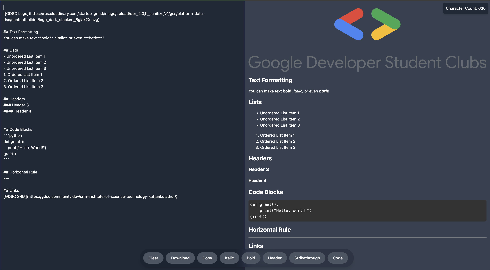
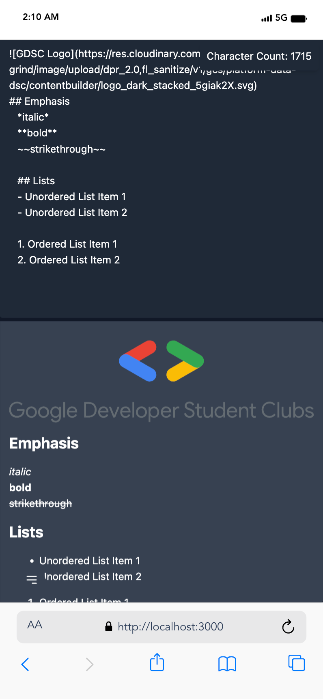

<h1 align="center" id="title">QuickMark Preview</h1>

<p id="description">QuickMark Preview is a web application designed to provide users with a convenient platform for writing and previewing Markdown-formatted text in real-time. Built using React the application allows users to input Markdown syntax in a text editor and instantly see the formatted output in a preview pane.</p>

<h2>🚀 Demo</h2>

[quickmark.lohitkolluri.tech](quickmark.lohitkolluri.tech)

  
  
<h2>🧐 Features</h2>

Here're some of the project's best features:

*   Real-time Markdown Rendering
*   Extensive Formatting Options
*   Emoji Shortcode Support
*   GitHub Flavoured Markdown Support

<h2>📷 Project Screenshots:</h2>




<h2>🛠️ Installation Steps:</h2>

<p>1. Clone the Repository:</p>

```
git clone https://github.com/lohitkolluri/QuickMark-Preview
```

<p>2. Navigate to the Project Directory:</p>

```
cd QuickMark-Preview
```

<p>3. Install Dependencies:</p>

```
yarn
```

<p>4. Start the Development Server:</p>

```
yarn dev
```

  
  
<h2>💻 Built with</h2>

Technologies used in the project:

*   React
*   React Markdown
*   Remark-GFM
*   ReHype-RAW
*   Tailwind CSS

<h2>🛡️ License:</h2>

This project is licensed under the [MIT License](LICENSE)
